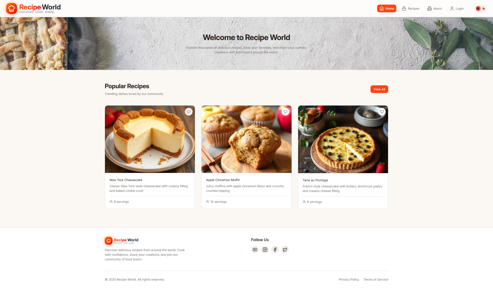
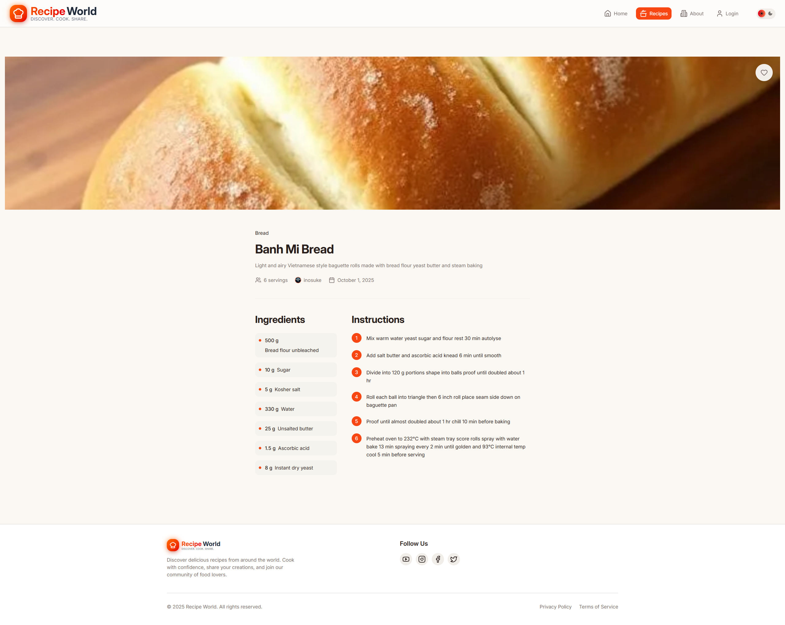
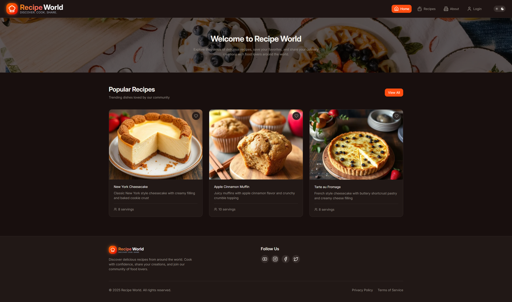
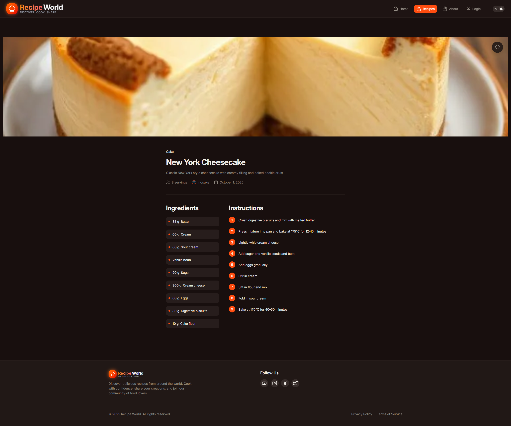
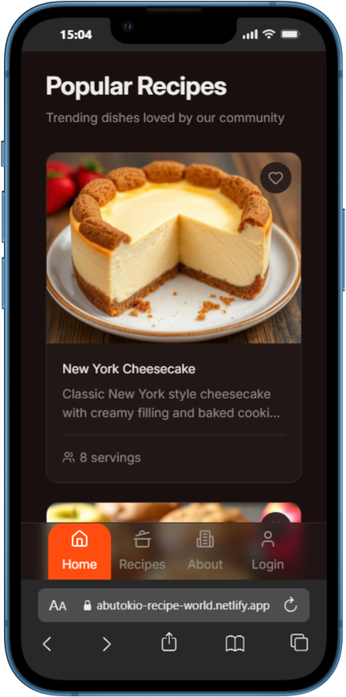
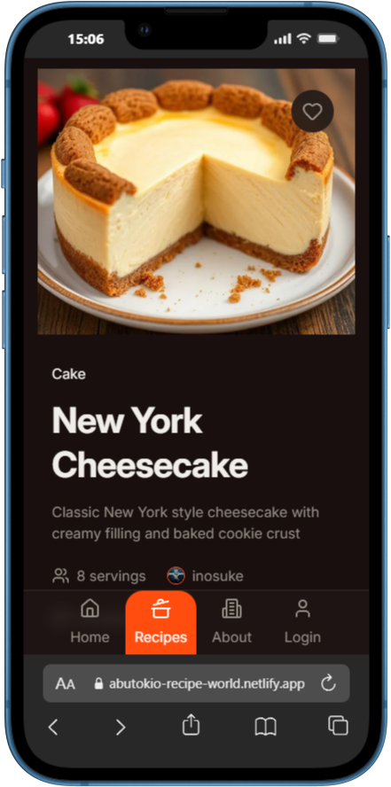

<div align="center">


**Discover. Cook. Share.**

A modern, full-stack recipe sharing platform built with React, TypeScript, and Supabase

[Live Demo](https://abutokio-recipe-world.netlify.app/) • [Report Bug](https://github.com/AbuTokio/recipe-world/issues)

[](https://www.typescriptlang.org/)
[](https://reactjs.org/)
[](https://tailwindcss.com/)
[](https://supabase.com/)
[](https://lottiefiles.com/)
[](https://lucide.dev/)
[](https://react-hot-toast.com/)
[](https://www.netlify.com/)

</div>

---

## 📖 About The Project

Recipe World is a comprehensive recipe sharing platform that allows users to discover, create, and share culinary creations. Built as part of a coding bootcamp backend module, this project showcases modern web development practices, full-stack architecture, and a well structured code quality.

### 🎯 Project Context

This application was developed during an intensive coding bootcamp as part of the backend development module. The project demonstrates:

- **Full-stack development** with React and Supabase
- **Database design** and relationship modeling
- **Authentication & Authorization** with row-level security
- **RESTful API** integration and best practices
- **Responsive UI/UX** design with modern aesthetics

---

## ✨ Key Features

### 🔐 Authentication & User Management

- Secure user registration and login with Supabase Auth
- Profile management with customizable information
- Profile picture uploads with CDN storage
- Session management and protected routes

### 📝 Recipe Management (CRUD)

- **Create** recipes with detailed information (ingredients, instructions, servings)
- **Read** recipes with beautiful, responsive layouts
- **Update** your own recipes with full edit capabilities
- **Delete** recipes with confirmation dialogs
- Recipe image uploads with automatic optimization
- Category-based recipe organization

### 🔍 Discovery & Social Features

- Browse recipes by category
- Follow/unfollow other users
- View follower/following lists
- Favorite recipes for quick access
- User profiles with recipe collections

### 🎨 Design & UX

- Light/Dark mode with seamless theme switching
- Custom color palette using OKLCH color space
- Responsive design (mobile-first approach)
- Smooth animations and transitions
- Accessible UI components
- Professional typography system

---

## 🛠️ Tech Stack

### Frontend

- **React 18** - UI library with hooks
- **TypeScript** - Type-safe development
- **Tailwind CSS v4** - Utility-first styling with custom design tokens
- **Lucide React** - Icon library
- **Custom Components** - Reusable UI component library

### Backend & Database

- **Supabase** - Backend-as-a-Service (BaaS)
  - PostgreSQL database
  - Row-level security (RLS) policies
  - Authentication & user management
  - File storage with CDN
  - Real-time subscriptions

### Development Tools

- **Vite** - Fast build tool and dev server
- **ESLint** - Code linting
- **Git** - Version control

---

## 📊 Database Schema

```sql
-- Categories
CREATE TABLE categories (
  id UUID PRIMARY KEY DEFAULT gen_random_uuid(),
  name TEXT NOT NULL UNIQUE,
  created_at TIMESTAMPTZ DEFAULT now()
);

-- Recipes
CREATE TABLE recipes (
  id UUID PRIMARY KEY DEFAULT gen_random_uuid(),
  name TEXT NOT NULL,
  description TEXT NOT NULL,
  servings INT NOT NULL,
  instructions TEXT NOT NULL,
  category_id UUID NOT NULL REFERENCES categories(id) ON DELETE CASCADE,
  user_id UUID NOT NULL REFERENCES auth.users(id) ON DELETE CASCADE,
  created_at TIMESTAMPTZ DEFAULT now()
);

-- Ingredients
CREATE TABLE ingredients (
  id UUID PRIMARY KEY DEFAULT gen_random_uuid(),
  recipe_id UUID NOT NULL REFERENCES recipes(id) ON DELETE CASCADE,
  name TEXT NOT NULL,
  quantity FLOAT,
  unit TEXT,
  additional_info TEXT,
  created_at TIMESTAMPTZ DEFAULT now()
);

-- Users
CREATE TABLE users (
  id UUID PRIMARY KEY REFERENCES auth.users(id) ON DELETE CASCADE,
  username TEXT UNIQUE NOT NULL CHECK (length(username) >= 3 AND length(username) <= 20),
  firstname TEXT,
  lastname TEXT,
  email TEXT UNIQUE NOT NULL,
  created_at TIMESTAMPTZ DEFAULT now()
);

-- Favorites
CREATE TABLE favorites (
  id UUID PRIMARY KEY DEFAULT gen_random_uuid(),
  user_id UUID NOT NULL REFERENCES auth.users(id) ON DELETE CASCADE,
  status TEXT,
  created_at TIMESTAMPTZ DEFAULT now()
);

CREATE TABLE favorites_items (
  id UUID PRIMARY KEY DEFAULT gen_random_uuid(),
  favorites_id UUID NOT NULL REFERENCES favorites(id) ON DELETE CASCADE,
  recipe_id UUID NOT NULL REFERENCES recipes(id) ON DELETE CASCADE,
  created_at TIMESTAMPTZ DEFAULT now()
);

-- Followers
CREATE TABLE followers (
  id UUID PRIMARY KEY DEFAULT gen_random_uuid(),
  follower UUID NOT NULL REFERENCES users(id) ON DELETE CASCADE,
  followed_by UUID NOT NULL REFERENCES users(id) ON DELETE CASCADE,
  created_at TIMESTAMPTZ DEFAULT now()
);
```

### Security Policies

- Row-level security (RLS) on all tables
- Authenticated user access control
- Owner-based permissions for recipes and favorites
- Public read access with protected writes
- Storage bucket policies for image uploads

---

## 🎨 Design System

### Color Palette

Recipe World uses a custom color system built with **OKLCH** color space for perceptually uniform colors:

- **Primary**: Orange to red gradient (inspired by the logo)
- **Secondary**: Warm amber/gold tones
- **Accent**: Fresh green (vegetables/herbs)
- **Background**: Warm cream/ivory (light) / Dark charcoal (dark)

### Typography

- **Primary Font**: Inter (sans-serif)
- **Responsive scaling** with rem units
- **Semantic heading** hierarchy (h1-h6)
- **Optimized line heights** for readability

---

## 🚀 Getting Started

### Prerequisites

- Node.js (v18 or higher)
- npm or yarn
- Supabase account

### Installation

1. **Clone the repository**

   ```bash
   git clone https://github.com/yourusername/recipe-world.git
   cd recipe-world
   ```

2. **Install dependencies**

   ```bash
   npm install
   ```

3. **Set up environment variables**

   Create a `.env` file in the root directory:

   ```env
   VITE_SUPABASE_URL=your_supabase_url
   VITE_SUPABASE_ANON_KEY=your_supabase_anon_key
   ```

4. **Set up Supabase**

   - Create a new Supabase project
   - Run the database migrations (SQL schema above)
   - Set up storage buckets:
     - `img-profiles` (for user profile pictures)
     - `img-recipes` (for recipe images)
     - `img-categories` (for category images)
   - Configure row-level security policies
   - Enable authentication providers

5. **Start the development server**

   ```bash
   npm run dev
   ```

6. **Open your browser**

   Navigate to `http://localhost:5173`

---

## 🌟 Feature Highlights

### State Management

- Client-side routing with state-based navigation
- Centralized state in App.tsx
- Prop drilling with TypeScript type safety

### Form Handling

- Custom form components (no external form libraries except react-hot-toast)
- Client-side validation
- Error handling and user feedback
- File upload with preview

### Image Management

- Profile picture uploads
- Recipe image uploads
- Category image support
- CDN delivery via Supabase Storage

### Responsive Design

- Mobile-first approach
- Breakpoint system (sm, md, lg, xl)
- Touch-friendly UI elements
- Optimized for all screen sizes

---

## 🎓 Learning Outcomes

Building Recipe World provided hands-on experience with:

### Backend Development

✅ Database design and normalization  
✅ Relational data modeling  
✅ Row-level security policies  
✅ Authentication and authorization  
✅ CRUD operations  
✅ File storage and CDN

### Frontend Development

✅ React component architecture  
✅ TypeScript type safety  
✅ State management  
✅ Responsive design  
✅ Custom component library  
✅ Theme switching (light/dark mode)

### Professional Practices

✅ Git version control  
✅ Code organization and modularity  
✅ Documentation  
✅ Error handling  
✅ User experience design

---

## 👨‍💻 About the Developer

**Bünyamin Kara** (AbuTokio)

I'm a passionate developer currently attending a coding bootcamp to transition from a successful automotive career into professional software development. My journey in coding began at age 14 as a self-taught programmer, and after working in various roles in the automotive industry (mechanic, system operator, process engineering, and KAIZEN specialist), I decided in early 2025 to pursue my true passion and mid 2025 started to visit a bootcamp.

### Background

- 🔧 **Former Career**: Automotive industry (Mechanic → Process Development & KAIZEN Specialist)
- 💻 **Coding Journey**: Self-taught since age 14
- 🎓 **Current**: Coding Bootcamp Student
- 🎯 **Goal**: Professional Software Developer

### Skills Applied in This Project

- Full-stack web development
- Database design and optimization
- Process thinking (from KAIZEN methodology)
- Problem-solving and debugging
- Attention to detail
- Continuous improvement mindset

**Connect with me:**

- 📧 Email: bunyaminxkara@gmail.com
- 💼 LinkedIn: [https://www.linkedin.com/in/bunyaminkara/](https://www.linkedin.com/in/bunyaminkara/)
- 🐙 GitHub: [https://github.com/AbuTokio](https://github.com/AbuTokio)

---

## 📝 Roadmap

### Current Features ✅

- [x] User authentication
- [x] Recipe CRUD operations
- [x] Category browsing
- [x] Social features (followers, favorites)
- [x] Image uploads
- [x] Responsive design
- [x] Light/Dark mode

### Possible Future Enhancements 🚀

- [ ] Clean up the code more
- [ ] Recipe search with filters (ingredients, cooking time, difficulty)
- [ ] Recipe ratings and reviews
- [ ] Comments on recipes
- [ ] Shopping list generation
- [ ] Meal planning calendar
- [ ] Nutrition information calculator
- [ ] Recipe sharing via social media
- [ ] Print-friendly recipe view
- [ ] Multi-language support
- [ ] Mobile app (React Native)

---

## 🤝 Contributing

This is a learning project and portfolio piece. However, feedback and suggestions are always welcome!

1. Fork the repository
2. Create a feature branch (`git checkout -b feature/AmazingFeature`)
3. Commit your changes (`git commit -m 'Add some AmazingFeature'`)
4. Push to the branch (`git push origin feature/AmazingFeature`)
5. Open a Pull Request

---

## 📄 License

This project is open source and available for educational purposes.

---

## 🙏 Acknowledgments

- **SuperCode GmbH & Co. KG** - For providing the learning environment and project requirements
- **[FaridTvK](https://github.com/FaridTvK)** - For the excellent work as our main trainer at SuperCode

---

## 📸 Screenshots

### Light Mode




### Dark Mode




### Mobile View

 

---

## 📧 Contact

**Project Maintainer**: Bünyamin Kara (AbuTokio)

- Email: bunyaminxkara@gmail.com
- Project Link: [https://github.com/AbuTokio/recipe-world](https://github.com/AbuTokio/recipe-world)

---

<div align="center">

**Made with ❤️ and lots of ☕ by [AbuTokio](https://github.com/AbuTokio)**

⭐ If you found this project interesting, please consider giving it a star!

</div>
